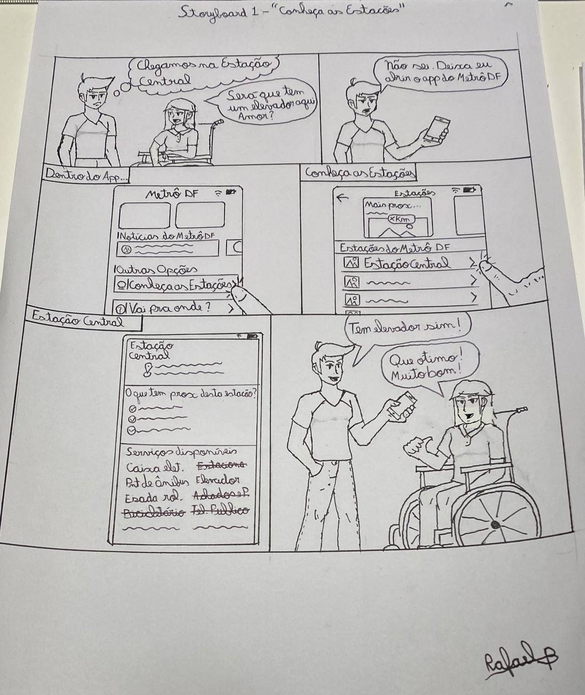
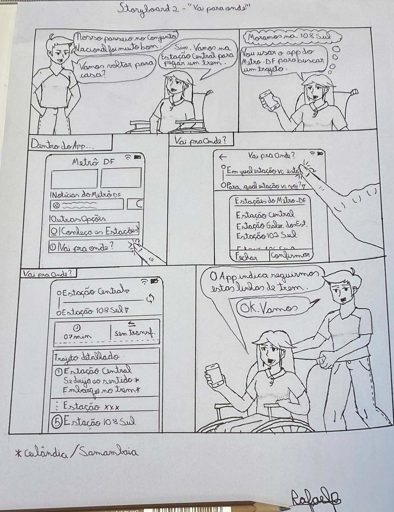

# Story Board

## O que é um Story board?

 Storyboard é uma técnica que utiliza imagens ou ilustrações em sequência para contar uma história com o objetivo de ilustrar situações de uso dos requisitos de um <a href="../../Modelagem/exico#aplicativo">sistema</a> ou software. Podem ser em formato de história em quadrinhos, colagens, fotografias, entre outros. 
Foram produzidas duas histórias que representam formas de como utilizar o <a href="../../Modelagem/exico#aplicativo">app</a> Metro-DF. A partir delas foram elicitados alguns requisitos que serão expostos logo abaixo de cada história. 

## Resultado 

### Story Board 1 - Conheça as Estações

Número | Requisitos
----------- | --------------
1            | O <a href="../../Modelagem/lexico#usuario">usuário</a> deve ser capaz de visualizar todas as <a href="../../Modelagem/lexico#estacao">estações</a> do DF
2            | O <a href="../../Modelagem/lexico#usuario">usuário</a> deve ser capaz de selecionar a Estação que deseja conhecer
3        | O <a href="../../Modelagem/exico#aplicativo">sistema</a> deve atualizar as informações de proximidade e <a href="../../Modelagem/lexico#servicos">serviços</a> disponíveis sobre a Estação 
4            | O <a href="../../Modelagem/exico#aplicativo">sistema</a> deve mostrar a localização da Estação procurada

### Story Board 2 - Vai Para Onde?

Número | Requisitos
----------- | --------------
1            | O <a href="../../Modelagem/lexico#usuario">usuário</a> deve ser capaz de visualizar todas as <a href="../../Modelagem/lexico#estacao">estações</a> do DF
2            | O <a href="../../Modelagem/lexico#usuario">usuário</a> deve ser capaz de selecionar a Estação em que está
3            | O <a href="../../Modelagem/lexico#usuario">usuário</a> deve ser capaz de selecionar para qual Estação quer ir
4          | O <a href="../../Modelagem/exico#aplicativo">sistema</a> deve mostrar o tempo que <a href="../../Modelagem/lexico#trajeto">trajeto</a> inteiro vai durar e se há necessidade de pegar outra linha de <a href="../../Modelagem/lexico#trem">trem</a>
5       | O <a href="../../Modelagem/exico#aplicativo">sistema</a> deve mostrar em quais paradas o <a href="../../Modelagem/lexico#usuario">usuário</a> deve passar e se será necessário descer do <a href="../../Modelagem/lexico#trem">trem</a>  para chegar ao destino 

## Referências
Livro: Vianna, Maurício; et.al. Design thinking : inovação em negócios. Rio de Janeiro. MJV Press, 2012.

## Histórico de Versões

| Data     | Versão | Descrição                                        | Autores        | Revisor          |
| ---------- | --------- | --------------------------------------------- | ---------------- | ---------------- |
| 18/08/2021 | 0.1| Criação do documento | Rafael   |                  |
| 18/08/2021 | 1.0| Adição de informações sobre story board | Rafael   |          |
| 18/08/2021 | 1.1| Adição dos story boards | Rafael   |                  |
| 18/10/2021 |  2.0   | Adição dos hyperlinks para os léxicos|   Rafael   |    |